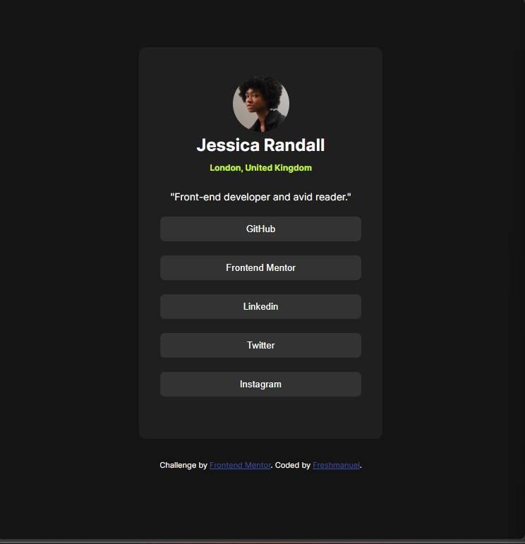

# Frontend Mentor - Social links profile solution

This is my solution to the [Social links profile challenge on Frontend Mentor](https://www.frontendmentor.io/challenges/social-links-profile-UG32l9m6dQ).

## Table of contents

- [Overview](#overview)
  - [The challenge](#the-challenge)
  - [Screenshot](#screenshot)
  - [Links](#links)
- [My process](#my-process)
  - [Built with](#built-with)
  - [What I learned](#what-i-learned)
  - [Continued development](#continued-development)
  - [Useful resources](#useful-resources)
- [Author](#author)

## Overview

### The challenge

Users should be able to:

- See hover, focus, and active states for all interactive elements

### Screenshot

### Links
- Solution URL:  https://www.frontendmentor.io/solutions/social-links-profile-with-html-and-css-DlFSqe9_xL
- Live Site URL: https://bigboyemma20.github.io/social-links-profile-main/

## My process

### Built with

- Semantic HTML5 markup
- CSS custom properties
- Flexbox
- Responsive design (Mobile-first workflow)

### What I learned

While working on this project, I improved my understanding of CSS transitions, hover/focus/active states, and how to use media queries for mobile responsiveness.

### Continued development

I would like to continue improving in advanced responsive techniques (like CSS Grid and more complex Flexbox layouts) and adding accessibility best practices.

### Useful resources

- [MDN Web Docs](https://developer.mozilla.org/en-US/)
- [Frontend Mentor](https://www.frontendmentor.io/)
- CSS tricks- Flexbox guide (https://css-tricks.com/snippets/css/a-guide-to-flexbox/)

## Author

- GitHub - [bigboyemma20](https://github.com/bigboyemma20)
- Frontend Mentor - [@bigboyemma20](https://www.frontendmentor.io/profile/bigboyemma20)
- Twitter - [@freshmanuel11](https://twitter.com/freshmanuel11)
